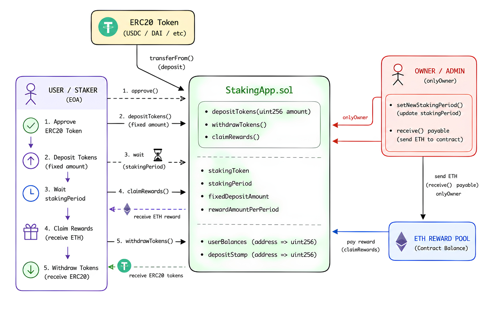

# Staking App

<div align="center">


</div>

---

<div align="center">
  
</div>

---

## Overview

A smart contract application that allows users to stake ERC20 tokens and earn ETH rewards over fixed staking periods. Built with Solidity and audited with comprehensive test coverage using Foundry.

## Features

- **Token Staking**: Users can deposit a fixed amount of tokens to start staking
- **Reward Distribution**: Earn ETH rewards after completing staking periods
- **Flexible Withdrawal**: Withdraw staked tokens at any time
- **Owner Control**: Contract owner can manage staking periods and fund rewards
- **ERC20 Integration**: Uses OpenZeppelin's secure ERC20 implementation

## Contracts

### StakingApp

Main contract handling staking operations, reward distribution, and configuration.

**Key Functions:**

- `depositTokens(uint256 amount)` - Stake tokens
- `withdrawTokens()` - Withdraw staked tokens
- `claimRewards()` - Claim accumulated ETH rewards
- `setNewStakingPeriod(uint256 period)` - Owner function to update staking duration
- `receive()` - Accept ETH for reward funding (owner only)

**Key Features:**

- Fixed deposit amount enforcement
- Time-based reward eligibility
- Secure token transfers with OpenZeppelin's ERC20
- Owner access control via Ownable pattern

### StakingToken

Simple ERC20 token contract used as the staking asset.

**Key Functions:**

- `mint(uint256 amount)` - Mint new tokens to caller

**Note:** In production, consider adding access control to restrict minting privileges.

## Installation

### Prerequisites

- [Foundry](https://book.getfoundry.sh/getting-started/installation) installed
- Git

### Setup

```bash
git clone <repository-url>
cd Staking-App
forge install
```

## Testing

Run the test suite with Foundry:

```bash
# Run all tests
forge test

# Run tests with verbose output
forge test -v

# Run specific test file
forge test test/staking-app/StakingApp.t.sol

# Run tests with coverage
forge coverage
```

### Test Coverage

All smart contracts have comprehensive test coverage:


| Contract               | Lines           | Statements      | Branches       | Functions     |
| ------------------------ | ----------------- | ----------------- | ---------------- | --------------- |
| `src/StakingApp.sol`   | 100.00% (33/33) | 100.00% (31/31) | 87.50% (14/16) | 100.00% (6/6) |
| `src/StakingToken.sol` | 100.00% (2/2)   | 100.00% (1/1)   | 100.00% (0/0)  | 100.00% (1/1) |

**Total: 16 tests passed** ✅

## Deployment

### Local Deployment (Foundry)

```bash
forge script script/DeployStakingApp.s.sol --broadcast
```

### Network-Specific Deployment

```bash
forge script script/DeployStakingApp.s.sol --broadcast --rpc-url <RPC_URL>
```

## Contract Architecture

```
StakingApp (Ownable)
├── Dependencies
│   ├── IERC20 (Token interface)
│   └── Ownable (Access Control)
└── Functions
    ├── depositTokens()
    ├── withdrawTokens()
    ├── claimRewards()
    ├── setNewStakingPeriod()
    └── receive()

StakingToken (ERC20)
└── mint()
```

## Security Considerations

- ✅ Uses OpenZeppelin's battle-tested ERC20 implementation
- ✅ Ownable pattern for access control
- ✅ Checks-Effects-Interactions pattern in critical functions
- ⚠️ StakingToken has unrestricted minting yet

## License

This project is licensed under the MIT License - see LICENSE file for details.

## Technologies Used


| Technology          | Purpose                                        |
| --------------------- | ------------------------------------------------ |
| **Solidity 0.8.34** | Smart contract language                        |
| **Foundry**         | Development, testing, and deployment framework |
| **OpenZeppelin**    | Secure ERC20 and Ownable implementations       |
| **Ethereum/EVM**    | Blockchain network                             |

## Contributing

Contributions are welcome! Please feel free to submit a Pull Request.

---

**Last Updated:** June 2026
